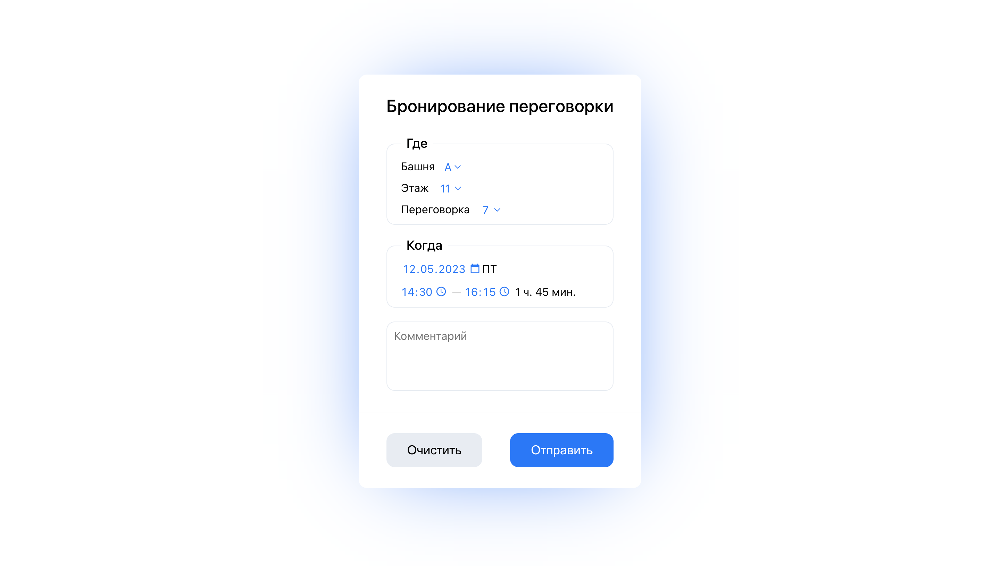

# Тестовое задание
Форма бля бронирования переговорных комнат

https://booking-blue.vercel.app

TypeScript · React



## Описание задания
Форма должна содержать следующие элементы:
- выпадающий список с выбором башни (А или Б)
- выпадающий список с выбором этажа (с 3 по 27)
- выпадающий список с выбором переговорки. На каждом этаже 10 переговорок
- выбор даты и интервала времени (в произвольном виде, например выпадающие списки, data-picker)
- поле ввода комментария (textarea)
- кнопка "Отправить" (по нажатию - выводить в консоль данные формы в виде json)
- кнопка "Очистить" (по нажатию очищает форму)

## Запуск проекта

- Установить зависимости
  ```shell
    npm install
    ```
- Запустить dev-сервер
    ```shell
    npm start
    ```